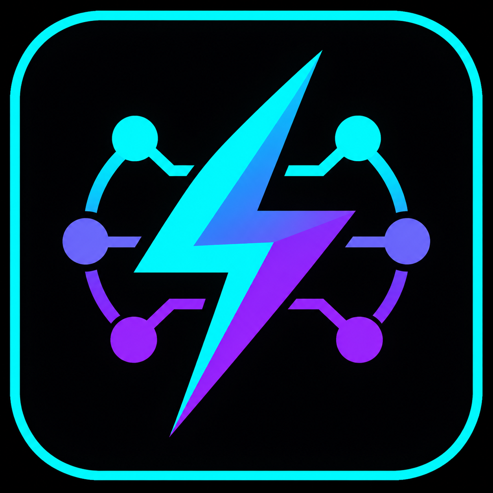

# FlashNext for GMKtec EVO-X2

<p align="center">
  
</p>

FlashNext turns one specific Windows mini PC into a private, local AI workstation. It installs and runs **Qwen3.8-Flash-Next** on the GMKtec EVO-X2, provides a desktop chat window and tray controls, and exposes an OpenAI-compatible API for other programs on the same computer.

The model weights are **not stored in this repository**. The installer downloads the six pinned model files from Hugging Face after the user accepts the model license, then verifies every file before using it.

## Install FlashNext

> **Hardware-specific:** This project is built for the **GMKtec EVO-X2** with an AMD Ryzen AI Max+ 395, Radeon 8060S, 128 GB installed memory, Windows 11 x64, and a **96 GB BIOS UMA frame buffer**. The installer deliberately stops on other hardware.

Before starting:

- Set the EVO-X2 BIOS UMA frame buffer to **96 GB**, save, and reboot.
- Have at least **40 GiB free on C:** for tools and compilation.
- Have at least **115 GiB free** for the model; **140 GiB is recommended**.
- Keep the PC connected to power and the internet. The first install is large and may take several hours.

Then:

1. Download the source installer ZIP from [Releases](https://github.com/HoodieRat/FlashNext-GMKtec-Windows/releases), or select **Code → Download ZIP** for the current source.
2. Extract the ZIP to a short local path such as `C:\FlashNext`. Do not run it from inside the ZIP.
3. Double-click **`install.cmd`**.
4. Approve Windows prompts for required signed tools and the final verified installation.
5. When asked where to store the model, press Enter for the suggested drive or enter another folder.
6. Read the model disclosure, then type **`ACCEPT`** to accept the Qwen Community License and begin the model download.
7. Leave the window open. If Windows requires a reboot or the connection is interrupted, reboot if needed and run `install.cmd` again. Completed stages and verified downloads are reused.
8. When installation finishes, open **FlashNext** from the Start menu. Click **Start AI server** and wait until the dashboard says **Running**.

That is the normal installation. See [INSTALL.md](INSTALL.md) for command-line options and common installation problems, or [docs/INSTALLATION.md](docs/INSTALLATION.md) for the internal design.

## Everyday use

1. Open **FlashNext** from the Windows Start menu.
2. If the panel is hidden, double-click the cyan-and-violet lightning icon in the system tray.
3. Click **Start AI server**. Loading the 107 GiB model commonly takes one to three minutes.
4. Wait for **Running**, type a message in the Chat tab, and press Enter.
5. Read the large **tok/s** card at the top for live generation speed. The tray menu also shows status and speed.

Closing the dashboard window hides it; it does not quit the program. Use **Quit FlashNext** from the tray menu to stop the server and exit. Do not run the tray dashboard and console Manager at the same time.

The shipped `coding-balanced` defaults use **Thinking Off**, Fixed MTP 6, draft confidence 0.75, Batch 4096, UBatch 2048, Q8 KV, and 131,072 context. Sampling defaults are temperature 0.7, top-p 0.8, top-k 20, min-p 0, presence penalty 1.5, repetition penalty 1, seed 0, and a 32,000-token output ceiling. The default system prompt focuses on complete software and detailed SVG artwork, with animation only when explicitly requested. The benchmark profile also uses MTP 6. Model storage remains an installer choice, and application updates preserve existing user settings and conversations.

The September 8 compact SVG validation used Batch 2048 and completed naturally at **32.55 generation tok/s**, with **zero cached prompt tokens**. Its prompt, output ceiling, seed handling, and cache settings differ from the current defaults, so selecting `coding-balanced` alone does not reproduce that request. This is one successful artifact, not a general reliability or production qualification; see the [validation record](docs/validation/2026-09-08-compact-svg/README.md). Historical 250-token checks (33.25 tok/s cold and 52.39 tok/s after warm-up) are not comparable quality benchmarks and do not establish sustained useful-output speed.

## What FlashNext provides

- A WPF desktop chat dashboard with live TPS, saved conversations, run reports, and server controls.
- A system-tray icon and menu for opening the panel, starting/stopping inference, and quitting cleanly.
- A local OpenAI-compatible chat API at `http://127.0.0.1:8080/v1`.
- A loopback-only control API at `http://127.0.0.1:18081` while the dashboard is open.
- A pinned Vulkan `llama.cpp` runtime and a pinned Unsloth UD-Q4_K_XL model revision.
- Fixed or adaptive multi-token prediction (MTP) using the matching Q8_0 draft sidecar.
- Q8 key/value cache, prompt caching, 131K context, vision-projector support, metrics, and diagnostics.
- Resumable installation, exact file verification, atomic activation, and rollback copies.
- C#, Python, Node.js, PowerShell, raw HTTP, OpenCode, and AgentWorkbench integration examples.

FlashNext is not a cloud service or a general-purpose model manager. It targets one pinned hardware/model/runtime combination; broader generation quality and production readiness remain to be validated.

## How it works

```text
You or another local program
             |
             |  desktop chat or authenticated localhost API
             v
   FlashNext Dashboard / Manager
             |
             |  starts and supervises one process
             v
      Pinned llama-server
             |
             |  Vulkan on Radeon 8060S
             v
 Qwen3.8-Flash-Next + MTP draft model
```

The server listens on localhost by default. FlashNext creates a random API key, stores it under `%LOCALAPPDATA%\FlashNextManager`, restricts the file permissions, and never prints the complete key in its logs. Prompts and replies stay on this computer unless another program explicitly sends them elsewhere. Network access is used during installation to obtain dependencies, source, and the pinned model files.

## Where files go

| Item | Location |
|---|---|
| Active desktop app | `%LOCALAPPDATA%\FlashNextManager\app\current` |
| Vulkan inference runtime | `%ProgramFiles%\FlashNextManager\runtime\current` |
| Settings, API key, conversations, logs | `%LOCALAPPDATA%\FlashNextManager` |
| Model files | The drive/folder selected during installation |

Run `install.cmd` again to update the application. Existing verified model files, settings, conversations, and runtime build caches are reused when compatible. Run `diagnose-install.cmd` after an installation failure. Run `uninstall.cmd` to remove the application and runtime; model files are retained unless the user explicitly chooses to remove them.

For an already provisioned machine, releases can also include a **prebuilt app-update ZIP** with Dashboard, Manager, shared libraries, and the inventory-verified updater. See [app-update instructions](docs/PREBUILT-APP-UPDATE.md). This bundle is not a replacement for first-time runtime/model installation.

## Using the local API

- Base URL: `http://127.0.0.1:8080/v1`
- Model name: `Qwen3.8-Flash-Next`
- API key file: `%LOCALAPPDATA%\FlashNextManager\api-key.txt`
- Health check: `GET http://127.0.0.1:8080/health`

See [the OpenAI-compatible API guide](integrations/openai-compatible.md) and the examples under [`integrations`](integrations/).

## Building and testing

The one-click installer handles normal builds. Developers can use the pinned .NET SDK from `global.json`:

```powershell
dotnet restore FlashNext.sln
dotnet test FlashNext.sln -c Release
dotnet publish src\FlashNext.Dashboard\FlashNext.Dashboard.csproj -c Release
dotnet publish src\FlashNext.Manager\FlashNext.Manager.csproj -c Release
```

Main components:

- `FlashNext.Core`: settings, chat/report models, metrics, and runtime arguments.
- `FlashNext.Infrastructure.Windows`: process supervision, hardware checks, installation, security, and control API.
- `FlashNext.Dashboard`: WPF chat and tray application.
- `FlashNext.Manager`: console interface and installer command modes.
- `FlashNext.VulkanProbe`: small native bootstrap probe used before tool installation.

Detailed documentation is in [`docs`](docs/). Runtime and model identities are locked under [`manifests`](manifests/); model weights, local API keys, and generated artifacts are excluded from Git.

## Licenses

FlashNext source is MIT licensed. The model is governed by the Qwen Community License 1.0 and is downloaded only after acceptance. The runtime and other dependencies retain their own licenses; see [THIRD_PARTY_NOTICES.md](THIRD_PARTY_NOTICES.md) and [`licenses`](licenses/).
